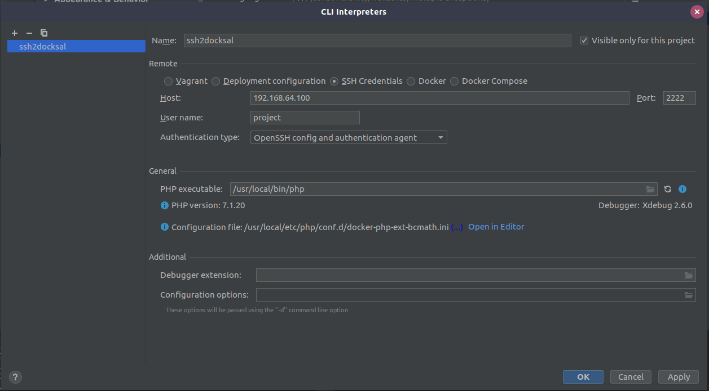
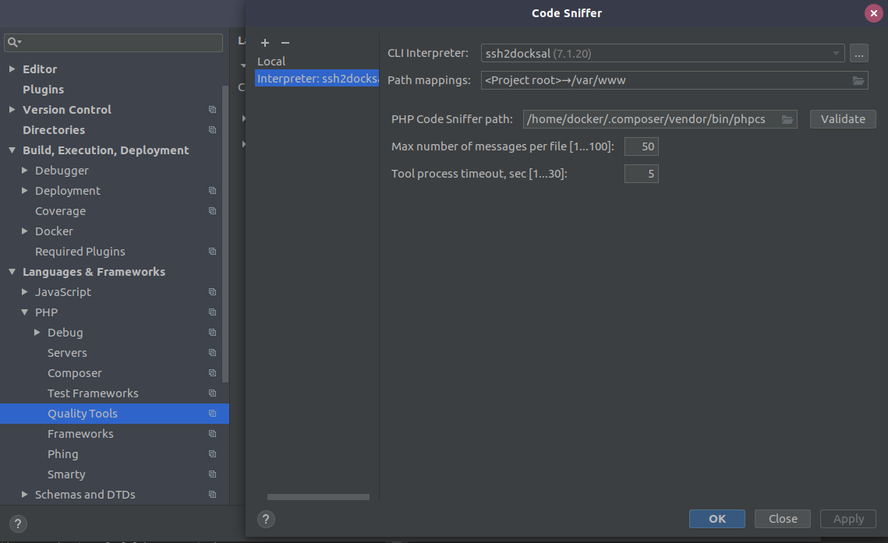
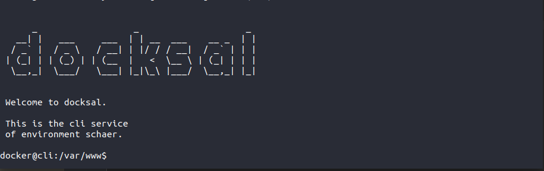

[](https://github.com/andock/ssh2docksal/releases/latest) [](https://travis-ci.org/andock/ssh2docksal)


# ssh2docksal
ssh2docksal is a ssh server which connects you directly to your docksal container via ssh. 

* Supports TTY
* Supports drush / rsync / scp
* Supports sftp (for phpStorm) 

# Sample:

Connect to the `cli` container of `project`
```
    ssh project@192.168.64.100 -p 2222
```

Connect to the `mysql` container of `project`
```
    ssh project---mysql@192.168.64.100 -p 2222
```

# For phpStorm
E.g. To connect phpStorm via ssh.

Startup:
```
docker run \
-d \
-e "HOST_UID=$(id -u)" \
-e "HOST_GID=$(cut -d: -f3 < <(getent group docker))" \
--restart=always \
-v /var/run/docker.sock:/var/run/docker.sock \
-v /usr/bin/docker:/usr/bin/docker \
--name andock-ssh2docksal \
--mount type=bind,src=${HOME}/.ssh/authorized_keys,dst=/home/docker/.ssh/authorized_keys \
-p 192.168.64.100:2222:2222 andockio/ssh2docksal --verbose
```

### Add remote debugger


### Add phpcs


### Debug mode: 
```
docker run \
-e "HOST_UID=$(id -u)" \
-e "HOST_GID=$(cut -d: -f3 < <(getent group docker))" \
-v /var/run/docker.sock:/var/run/docker.sock \
-v /usr/bin/docker:/usr/bin/docker \
--name andock-ssh2docksal \
--mount type=bind,src=${HOME}/.ssh/authorized_keys,dst=/home/docker/.ssh/authorized_keys \
-p 192.168.64.100:2222:2222 andockio/ssh2docksal --verbose
```

# For sandbox servers:
E.g. to run drush sql-sync.

Startup:
```
docker run \
-d \
-e "HOST_UID=$(id -u)" \
-e "HOST_GID=$(cut -d: -f3 < <(getent group docker))" \
--restart=always \
-v /var/run/docker.sock:/var/run/docker.sock \
-v /usr/bin/docker:/usr/bin/docker \
--name andock-ssh2docksal \
--mount type=bind,src=${HOME}/.ssh/authorized_keys,dst=/home/docker/.ssh/authorized_keys \
-p 0.0.0.0:2222:2222 andockio/ssh2docksal 
```

## Login:
```
    ssh project@192.168.64.100 -p 2222
```
